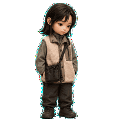
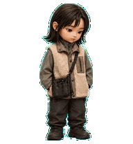

# Mori

เพื่อน humanoid แบบ 3D toy ผมบ๊อบสีน้ำตาลเข้ม เสื้อแจ็กเก็ตโทนเขียว เสื้อกั๊กขนสีครีม กางเกงสีถ่าน และกระเป๋า utility สีดำ ออกแบบจาก [ภาพอ้างอิงต้นฉบับ](../../references/mori/reference.png) และ [คอนเซปต์ที่อนุมัติ](../../references/mori/approved-concept.png)

## ไฟล์ใช้งาน

- [pet.json](pet.json): ID `mori`, ชื่อ `Mori`, `spriteVersionNumber: 2`
- [spritesheet.webp](spritesheet.webp): atlas โปร่งใสขนาด 1536 × 2288 พิกเซล ช่องละ 192 × 208 พิกเซล
- [brief.json](brief.json): รายละเอียดรูปลักษณ์ สไตล์ และลำดับ animation

ติดตั้งโดยนำ `pet.json` และ `spritesheet.webp` ไปไว้ด้วยกันใน `~/.codex/pets/mori/` แล้วเลือก Mori จากตัวเลือก pet ใน Codex เมื่อมีให้ใช้งาน

## Animation

เลขแถวและคอลัมน์เริ่มจาก 0

| แถว | State | จำนวนเฟรม |
| --- | --- | --- |
| 0 | idle | 6 |
| 1 | running-right | 8 |
| 2 | running-left | 8 |
| 3 | waving | 4 |
| 4 | jumping | 5 |
| 5 | failed | 8 |
| 6 | waiting | 6 |
| 7 | running — กำลังทำงานด้วยท่าทางและสายตา | 6 |
| 8 | review | 6 |
| 9 | มอง 000° ถึง 157.5° | 8 |
| 10 | มอง 180° ถึง 337.5° | 8 |

Neutral frame อยู่แถว 0 คอลัมน์ 6 ส่วนช่องที่ไม่ได้ใช้โปร่งใส ทิศการมองเริ่มที่ 000° = ด้านบน และหมุนตามเข็มนาฬิกาทีละ 22.5°

## ผลตรวจ

Atlas ผ่านการตรวจ v2 ทั้งขนาด โครงสร้าง และความโปร่งใส การตรวจภาพเคลื่อนไหวแยกอิสระผ่านครบทุกแถว และผู้ตรวจแบบไม่เห็นชื่อทิศ 3 คนยืนยันทิศหลักทั้งสี่ได้ถูกต้อง

การตรวจแบบปิดป้ายมีคำเตือนเฉพาะทิศระหว่างกลาง: คู่ 157.5°/202.5° อ่านแกนนอนกลับกัน และคู่ 247.5°/292.5° อ่านแกนตั้งได้ไม่ชัด เมื่อตรวจพร้อมป้ายกำกับและดูเป็นลูปต่อเนื่อง ทิศเหล่านี้ยังอยู่ใน quadrant ที่ถูกต้องและไม่มีการย้อนทิศ ช่วง 157.5° → 180° เป็นค่าความต่างที่สูงกว่าคู่ข้างเคียง แต่ไม่พบตัวเด้ง การเลื่อนตำแหน่ง หรือใบหน้าเปลี่ยนในการตรวจภาพจริง

การเลือก Mori ใช้งานจริงใน Codex UI ยังไม่ได้ทดสอบ ดู [ภาพรวมทุกเฟรม](qa/contact-sheet-extended.png), [ทิศการมอง](qa/look-directions.png) และ [คำอธิบายรายงาน QA](qa/README.md)

## แนวทางภาพ

สร้างด้วย `image_gen` แล้วประกอบและตรวจ atlas ด้วย `hatch-pet` รูปลักษณ์เป็น 3D collectible toy แบบ humanoid ที่ยังดูโตและนิ่ง รายละเอียดผ้า sherpa เสื้อชั้นใน ทรงผม และกระเป๋าต้องคงที่ทุกเฟรม กระเป๋าเป็นพร็อพชิ้นเดียวและติดกับลำตัวเสมอ
